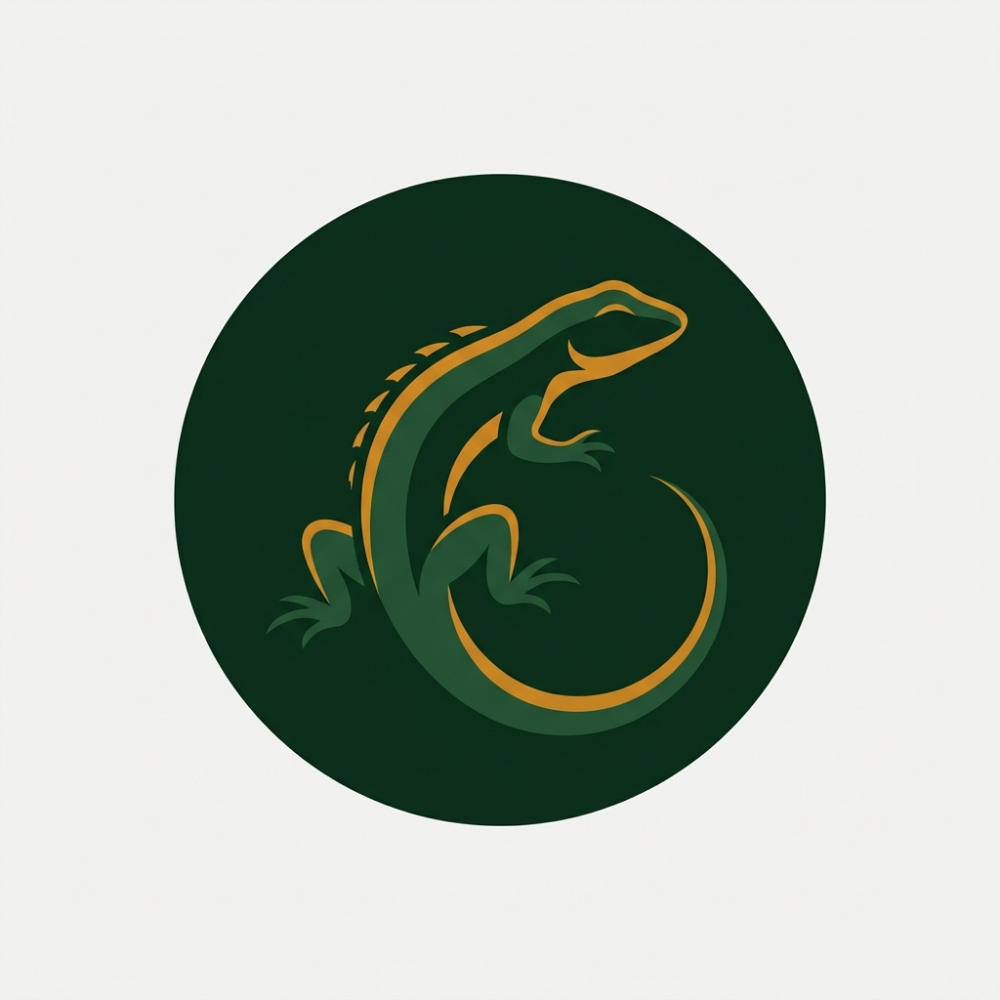

<div align="center">
  

  # Lizard Lens

  **On-device lizard detection for Android** — identify lizards from photos, live camera, or video, entirely offline.

  [](https://github.com/USER/lizard-lens/actions)
  
  
  
  

  [Features](#features) • [Getting started](#getting-started) • [Tech stack](#tech-stack)

</div>

Lizard Lens runs a YOLOv8n model quantized to INT8 TensorFlow Lite via MediaPipe Tasks Vision, processing frames with GPU acceleration for real-time bounding box overlays. No network calls — the entire pipeline stays on-device.

## Features

- **Three input modes** — pick a photo from your gallery, point your camera at a lizard in real time, or load a recorded video for frame-by-frame analysis.
- **Bounding box overlays** — detected lizards are outlined with amber boxes and labeled with species name and confidence score.
- **Offline-first** — model weights are bundled in the APK. No internet permission required.
- **GPU-accelerated inference** — MediaPipe delegates to OpenGL / Vulkan, with automatic CPU fallback on older devices.
- **Confidence threshold control** — adjust the detection cutoff and video frame-skip rate from an in-app settings dialog.
- **Field guide** — built-in reference of lizard species with scientific names, habitats, and identification keys.
- **Sighting log** — home screen feed records detected species with location, confidence, and notes.
- **Dark mode** — fully themed light and dark colour schemes with amber detection overlays that remain visible in both.

## Getting started

### Prerequisites

- [Android Studio](https://developer.android.com/studio) Koala or later
- JDK 17+
- An Android device or emulator running API 24+

### Clone and build

```bash
git clone https://github.com/USER/lizard-lens.git
cd lizard-lens

# Build debug APK
./gradlew assembleDebug

# Install on connected device
./gradlew installDebug
```

The debug APK is signed with the default Android debug keystore. For a release build, configure a keystore and signing credentials (see [release signing](#release-signing)).

## Tech stack

| Component | Library / API |
|---|---|
| Language | Kotlin 2.1 |
| UI | Jetpack Compose (Material 3, Canvas, Box) |
| Camera | CameraX (core, camera2, lifecycle, view) |
| ML inference | MediaPipe Tasks Vision (GPU delegate) |
| Video playback | ExoPlayer (media3-exoplayer, media3-ui) |
| Image loading | Coil |
| Theme | Custom `LizardLensTheme` with light/dark colour schemes |
| Min / Target SDK | 24 / 35 |
| Build | Gradle 8.7 with Kotlin DSL |
| CI | GitHub Actions (`assembleDebug` on push) |

## FAQ

**Does the app need internet?** No. All inference runs on-device with no network calls.

**What species can it detect?** The model is trained on a single-class "lizard" dataset. The app includes a hardcoded species list for display labels — see `DetectionState.kt` for the reference guide entries.

**Why amber bounding boxes?** Amber (`#FFD166`) was chosen because it remains visible against natural backgrounds — foliage, sky, rock, and soil — unlike red or green which blend in.

**Can I add my own model?** Replace the `.tflite` file in `app/src/main/assets/` and update the model path in `ObjectDetector.kt`. Ensure the model expects 640×640 RGB input.
